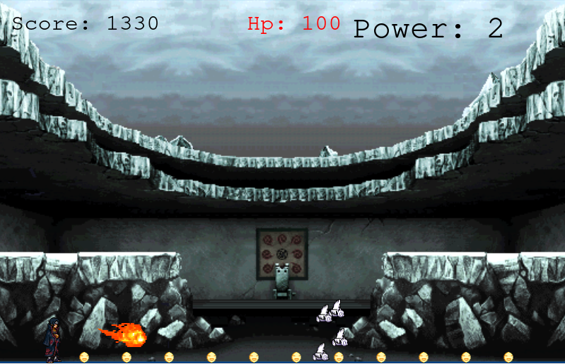

# Javascript Game

## About

In this application, I created an RPG game in which the user controls Itachi (from the anime of Naruto), collect coin, and try to avoid the bombs.

To build this application we used:

- Javascript ES6
- Webpack
- Html/CSS
- Phaser 3
- Linters ( eslint and stylelint)

## Live-Demo

[The live demo link](http://youcef.abdellani.dev/javascript_game/)

## Features

- Moving the character.
- Increasing the speed and jumping abilities.
- using fireball technic to burn bombs.
- Submit score.

## How to play

In the beginning, Itachi has 100 points of life (hp). The user can use the arrows (left and right) to run, (up) to jump. each time he collects a coin he gets 10 points in score. If he get 12 coins the power points will be increased by 1, his speed and jumping abilities will increase and a bomb will be added to the scene. If the player gets touched by a bomb he will lose 20 points of score and 12 points of HP. If Itachi has 3 points of power he can use the fireball technic to burn the bombs by clicking ("Space"). if the HP arrives at 0, Itachi dies and the user loses.

## games images

### Main Menu


### Score scene


### Playing Scene


### submiting score


## Getting started (Development)

To get a local copy of the repository please run the following commands on your terminal:

```
$ git clone git@github.com:ABDELLANI-Youcef/javascript_game.git
$ cd javascript_game
$ git checkout development
$ git branch game-branch
$ git checkout game-branch

```

## Launch the application

After making the local copy of the repository:
- get inside the repository folder;
- setup the dependencies of the project: in the terminal run: ```npm install```
- enter the command: ```npm run start```.
- then you get the game in the localhost in your web browser.

## Author

**Youcef Abdellani**

- Github: [@ABDELLANI-Youcef](https://github.com/ABDELLANI-Youcef)
- LinkedIn:[LinkedIn](linkedin.com/in/youcef-abdellani)
- Twitter:[@YoucefAbdellani](https://twitter.com/YoucefAbdellani)

## 🤝 Contributing

Contributions, issues ,and feature requests are welcome!

## Show your support

Give an ⭐️ if you like this project!

## Acknowledgments

- [Odin Project](https://www.theodinproject.com/courses/javascript/lessons/weather-app)
- Hat tip to [stackoverflow](https://stackoverflow.com) community.
- Hat tip to [Microverse](https://www.microverse.org/) TSE for Code Review
- Hat tip to [sprite sheet database](https://spritedatabase.net) for sprite sheet
- Hat tip to anyone whose code was used

## Issues
If you would like to report an issue [the link](https://github.com/ABDELLANI-Youcef/javascript_game/issues)

## 📝 License

All source code is available jointly under the MIT License.
See [MIT licence]() for details.
